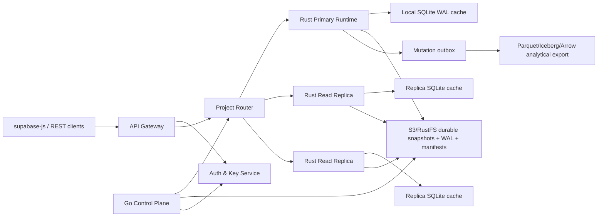

# Serverless DB 生产级 Review 与未来规划

日期：2026-06-21

范围：当前仓库实现、远端 Docker 集群 `8.147.71.246`、Supabase SDK 兼容层、D1-like 分布式可靠性路线。

## 一句话结论

当前 POC 已经证明了核心方向可行：Rust data plane + SQLite 热缓存 + S3/RustFS 冷存储 + snapshot/WAL manifest + 单主写入 + read replica + Supabase SDK 最小 CRUD 入口。但它还不能按生产服务对外开放。最大阻断项不是性能，而是公开部署安全边界、Supabase/PostgREST/Auth 语义兼容、对象存储写入模型、运维可观测和灾备能力。

语言决策继续保持：核心 data plane 用 Rust；未来 control plane、调度、项目生命周期、证书和部署编排可以用 Go；console/SDK/验证脚本继续用 TypeScript。

## 当前状态

- 本地核心实现位于 `rust-core/`，早期 TypeScript POC 保留在 `src/`。
- 公网 primary URL：`http://8.147.71.246`。2026-06-21 复核 `/health` 返回 `{"ok":true}`。
- 远端 Docker 当前运行对象存储、primary、`replica-a`、`replica-b`，均为 healthy。
- 本地 `deploy/docker-compose.distributed.yml` 当前声明的是 `rustfs` 服务；远端正在运行的容器仍显示为旧的 `minio` 服务和 `quay.io/minio/minio:latest` 镜像，存在部署运行态漂移。
- `reports/remote-supabase-compatibility-report.md` 显示 supabase-js 最小链路通过：health、`insert().select()`、`select().eq().limit()`、`update().eq().select()`、`delete().eq().select()`、两个副本异步追赶、一个副本写转发。
- 当前兼容范围明确很窄：只支持 `/rest/v1/{table}` 的表级 CRUD、`eq` 和 `limit`，不支持 Supabase Auth API、Storage API 协议兼容、Realtime 协议兼容、RPC、join/embedding、`or`、`in`、`order`、range/count 和 Postgres 错误语义。

## Review Findings

### P0 - 公网管理面完全缺少鉴权

证据：

- `rust-core/src/http.rs:20-56` 将 `/v1/tokens`、`/v1/projects`、`/v1/projects/{project_id}/hibernate`、`/v1/projects/{project_id}/crash`、schema、tables、policies、buckets、storage、events、realtime 全部注册为公开路由。
- `rust-core/src/http.rs:99-102` 的 `/v1/tokens` 可以直接 mint token。
- `rust-core/src/http.rs:137-149` 的 hibernate/crash 管理接口没有 admin actor。
- `rust-core/src/runtime.rs:1331-1356` 的建表和 policy 修改进入写队列，但入口侧没有管理鉴权。

影响：公网部署下，任意访问者可以 mint 任意 `sub/role` token、建项目、建表、修改 policy、触发 hibernate/crash，等同于完全接管服务。

必须修复：

- 给所有 `/v1/projects/*` 管理 API 加 admin/service-role middleware。
- `/v1/tokens` 只保留本地开发模式，生产环境禁用，或改成受控 Auth service。
- hibernate/crash 只能在 authenticated admin + allowlist 环境启用。
- 添加负向集成测试：匿名请求管理 API 必须返回 401/403。

### P0 - 默认 JWT secret 和部署 secret 可预测

证据：

- `rust-core/src/auth.rs:128-130` 在 `SDB_JWT_SECRET` 缺失时默认使用 `dev-secret-change-me`。
- `deploy/docker-compose.distributed.yml:47`、`:108`、`:163` 默认 `SDB_JWT_SECRET` 为 `distributed-poc-secret`。
- `deploy/docker-compose.distributed.yml:6-7`、`:25-26`、`:43-44` 默认对象存储访问密钥为 `serverlessdb/serverlessdb-secret`。
- `deploy/docker-compose.distributed.yml:10-12` 将对象存储 API/console 端口 `9000/9001` 直接发布到宿主机。

影响：公开部署一旦使用默认值，任何拿到代码的人都能伪造 token 或访问对象存储；如果 `9000/9001` 被安全组放开，对象存储也会直接暴露到公网。

必须修复：

- 生产模式缺少 `SDB_JWT_SECRET` 直接 fail fast。
- bootstrap 自动生成 `.env` 中的强随机 secret，禁止提交。
- 区分 anon key、service-role key、admin key，service-role key 只能服务端使用。
- 增加 secret rotation 流程和兼容窗口。

### P0 - 公网 HTTP 明文暴露，CORS 全开放

证据：

- `deploy/docker-compose.distributed.yml:87-89` 将 primary 直接映射到 host `80` 和 `8765`。
- `rust-core/src/http.rs:376-393`、`:753-760` 给 Supabase 入口返回 `Access-Control-Allow-Origin: *`。
- 当前远端报告记录公网入口为 `http://8.147.71.246`。

影响：Supabase anon key/JWT、用户数据和管理操作都在明文 HTTP 上传输；CORS 全开放会扩大浏览器侧滥用面。

必须修复：

- 前置 Caddy/Nginx/Traefik 做 TLS termination，只暴露 HTTPS。
- 禁用公网直连 `8765`，primary 只绑定内网或反代网络。
- CORS 改为 project allowlist，开发环境才允许 `*`。
- 上线前轮换当前远端所有 token 和 secret。

### P0 - Storage、events、realtime 读取缺少 actor/policy 校验

证据：

- `rust-core/src/http.rs:565-576` 的 `get_object` 没有读取 `Authorization`，直接调用 runtime。
- `rust-core/src/runtime.rs:1566-1592` 的 `get_object` 没有 actor 参数，也没有 policy 判断。
- `rust-core/src/http.rs:604-643` 的 events/realtime 没有 actor。
- `rust-core/src/runtime.rs:1623-1669` 的 outbox 读取没有 row-level 过滤。

影响：Storage object 和 mutation outbox 会绕过现有 policy DSL，被匿名读取。

必须修复：

- `get_object/events/realtime` 全部传入 actor。
- Storage 元数据表 `_sdb_objects` 加 policy 模型，默认私有。
- Realtime/outbox 按 table policy 或 topic policy 过滤。
- 对匿名读取 storage 和 events 加回归测试。

### P1 - 本地部署资产和远端运行态漂移

证据：

- 本地和远端 `deploy/docker-compose.distributed.yml:2-14` 都声明 `rustfs`。
- 远端 `docker compose ps` 当前仍显示运行中的对象存储容器服务名为 `minio`，镜像为 `quay.io/minio/minio:latest`。

影响：报告、故障注入和真实运行环境不是同一个对象存储实现，后续定位 conditional put、lease、listing 和健康检查问题时会误判。

必须修复：

- 清理远端 orphan/stale container，按当前 compose 重新部署。
- 在报告中写入 compose digest、镜像 digest、服务名和运行容器 ID。
- CI 增加 `docker compose config` 和远端 `docker compose ps` drift check。

### P1 - Supabase 兼容层仍只是 PostgREST 子集

证据：

- `rust-core/src/http.rs:37-44` 只注册 `/rest/v1/{table}` 单表路由。
- `rust-core/src/http.rs:686-720` 明确只转换 `select`、`limit`、`eq`，对 `order`、`offset`、`or`、`and` 返回不支持。
- `scripts/supabase-compat-check.mjs:158-165` 报告也声明兼容范围只覆盖基础 CRUD。

影响：现有 Supabase SDK 能跑通最小 CRUD，但真实应用常用的 select projection、range、count、order、`in/is/or`、嵌套资源、RPC、错误码和 `Prefer` 行为都会失败或语义不同。

必须修复：

- 建 PostgREST compatibility matrix，按 supabase-js method 逐项定义 supported/partial/not-supported。
- 实现 projection、range/count、order、`in/is/not/or/and` 的解析和 SQL 编译。
- 响应头补齐 `Content-Range`、count、`Prefer: return=minimal/representation` 行为。
- 错误模型向 PostgREST/Supabase 客户端习惯靠拢。

### P1 - Auth/RLS 不是 Supabase 语义

证据：

- `rust-core/src/auth.rs:51-105` 只校验本项目自定义 HS256 JWT。
- `rust-core/src/runtime.rs:2070-2074`、`:2126-2154`、`:2208-2209` 通过自研 policy DSL 做 gateway 层过滤。
- `README.md:392-396` 也明确没有 Postgres RLS、PostgREST、extensions、PL/pgSQL。

影响：当前可以做 Supabase-like，而不是 Supabase-compatible。已有 Supabase 项目迁移过来时，auth schema、JWT claims、Postgres role、service-role bypass、RLS expression 都无法复用。

必须修复：

- 明确产品定位：`lite-serverless` 是 Supabase SDK-compatible subset，不宣称 Postgres parity。
- 最小实现 anon/service-role/admin key 语义。
- policy compiler 引入 allow/deny audit，可解释为什么某行被过滤。
- 若要完整兼容，需要另开 Postgres-compatible tier。

### P2 - S3 adapter 当前是同步 trait + 阻塞桥接

证据：

- `rust-core/src/object_store.rs:17-34` 的 `ObjectStore` 是同步 trait。
- `rust-core/src/object_store.rs:502-521` 通过 `block_in_place` 或新线程桥接 async AWS SDK。

影响：当前修复了嵌套 Tokio runtime panic，但高并发下对象存储 IO 会占用 blocking pool 或生成线程，吞吐、尾延迟和容量规划不可控。

建议：

- 将对象存储接口升级为 async trait，runtime 写路径按阶段显式 await。
- 或引入 dedicated object-store worker pool + backpressure + metrics。
- 对 list/head/get/put/delete 分别记录 latency、retry、bytes、error code。

### P2 - Manifest 与 lease 缺少更强的 CAS/fencing 约束

证据：

- writer lease 使用 conditional create claim 是正确方向。
- `rust-core/src/runtime.rs:2594-2599` 写 manifest 使用普通 `put_bytes`，没有带 generation/fencing token 的 compare-and-swap。

影响：理论上 writer lease 能避免多主，但在对象存储最终一致行为、时钟漂移、手工误操作或 bug 下，manifest 仍可能被旧 owner 或错误 owner 覆盖。

建议：

- manifest 写入引入 `previous_generation`、`fencing_token`、`owner_id`。
- 对支持条件写的对象存储使用 If-Match/ETag CAS。
- 对不支持条件写的对象存储禁用生产部署，或在 control plane 层提供 quorum/lock service。

### P2 - Storage object 和元数据更新不是一个原子事务

证据：

- `rust-core/src/runtime.rs:2284-2313` 先写 object store，再写 SQLite 元数据。
- `rust-core/src/runtime.rs:2334-2342` 删除时先提交元数据删除，再删 object store。

影响：写元数据失败会留下 orphan object；删 object 失败会留下不可见 object。生产环境需要可恢复的 pending state 和 GC，不应依赖最好努力。

建议：

- 引入 storage object state：pending/committed/deleting/deleted。
- outbox 驱动异步 GC 和 repair worker。
- 定期 reconcile `_sdb_objects` 与 object-store prefix。

### P2 - 镜像和依赖未 pin，供应链不可复现

证据：

- `Dockerfile:1`、`:23` 使用镜像 tag 而不是 digest。
- `deploy/docker-compose.distributed.yml:3` 使用 `rustfs/rustfs:latest`。
- `deploy/docker-compose.distributed.yml:20` 使用 `amazon/aws-cli` 未 pin digest。

影响：同一个 compose 在不同日期可能拉到不同二进制，兼容报告不能复现。

建议：

- 所有镜像 pin digest。
- 生成 SBOM 和镜像 provenance。
- CI 记录 `cargo metadata`、`Cargo.lock`、镜像 digest、Git tree hash。

## 目标架构

核心边界：

- **Data plane**：Rust。负责 SQLite connection、WAL/snapshot、object-store IO、writer queue、lease/fencing、read replica refresh、PostgREST subset 编译和 hot path 性能。
- **Control plane**：Go。负责 project lifecycle、租户/配额、placement、replica topology、证书、secret rotation、deployment rollout、health aggregation、billing/cost model。
- **Gateway**：可以先并入 Rust HTTP 层，生产版建议独立出来，承担 TLS、auth、routing、rate limit、CORS、compat headers、audit。
- **Durable source of truth**：对象存储里的 immutable snapshot、WAL segment、manifest timeline，不是本地 SQLite cache。
- **Consistency contract**：默认读可以走就近 replica；写和强一致读走 primary；session/bookmark 读必须等副本追到指定 bookmark，否则 fallback primary 或返回 425/timeout。
- **Analytics**：先不阻塞 OLTP。通过 outbox/export 生成 Parquet/Iceberg/Arrow 数据集，作为离线分析层，不把 DuckDB/Arrow 放进主写路径。

## 对标 Cloudflare D1 的可靠性设计

Cloudflare D1 的关键不是“SQLite 可以无限分布式写”，而是明确边界：单库单主写、异步 read replica、Sessions/bookmarks 提供顺序一致性、Time Travel/PITR 提供误操作恢复。

本项目应对齐以下能力：

| D1-like 能力 | 当前状态 | 目标 |
| --- | --- | --- |
| 单库单写 | writer queue + object-store writer lease/fencing 已有 | manifest CAS、lease renew、跨 region clock skew 验证 |
| Read replica | `--read-replica` + manifest refresh 已有 | 自动 placement、lag-aware routing、集中健康状态 |
| Sessions/bookmark | `sdb1-*` bookmark、header/query 读取已有 | SDK session object、跨请求 bookmark store、强一致 fallback 策略 |
| 写转发 | replica 写转发 primary 已有 | 幂等键强制、retry audit、trace propagation |
| PITR/Time Travel | 尚无 | manifest timeline 保留、按 timestamp/bookmark restore、dry-run diff |
| Backpressure | writer queue 429、WAL budget 507 已有 | project/tenant rate limit、object-store IO budget、shed load policy |
| 可观测 | project info 有 lag 和 routing 信息 | Prometheus/OpenTelemetry、SLO dashboard、alert |

## Roadmap

### P0 - 公开验证环境安全加固

目标：把远端服务从“公开 POC”改成“可控验证环境”。

交付项：

- 管理面鉴权 middleware：匿名访问 `/v1/tokens`、`/v1/projects/*`、`hibernate`、`crash`、policy 修改必须拒绝。
- 生产模式禁用默认 secret；bootstrap 生成 `.env`，所有 secret 不进 repo。
- HTTPS 反代，只暴露 `443`；关闭公网 `8765`、`9000`、`9001`。
- 对象存储仅内网可达；root credentials 随机化。
- CORS allowlist。
- 清理远端 MinIO/RustFS 漂移，重新部署并更新兼容报告。
- 所有 Docker image pin digest。

验收门槛：

- 匿名管理 API 负向测试全部通过。
- `curl http://8.147.71.246` 不再暴露明文服务。
- `docker compose ps` 与仓库 compose 服务名一致，无 orphan 容器。
- 新报告记录 image digest、compose hash、测试命令和生成时间。

### P1 - Supabase SDK 兼容性从 smoke test 扩展为矩阵

目标：形成可公开承诺的 compatibility contract。

交付项：

- `reports/supabase-compatibility-matrix.md`：列出 supabase-js `.from()`、Auth、Storage、Realtime、RPC 的 supported/partial/not-supported。
- PostgREST parser v1：projection、`limit/offset/range`、`order`、`eq/neq/gt/gte/lt/lte/in/is/not`、`or/and`。
- `Prefer` header：`return=minimal`、`return=representation`、count header。
- 错误响应规范化：status、code、message、details、hint。
- anon/service-role key 语义和最小 Auth token 验证。
- Storage API compatibility seed：bucket/object CRUD 路由对齐 Supabase Storage。
- Realtime compatibility seed：先支持 server-sent change stream，再评估 Phoenix/WebSocket parity。

验收门槛：

- supabase-js compatibility CI 每项独立报告。
- 每个 unsupported 能力都有明确错误和文档说明。
- 示例应用不改 SDK，只改 URL/key 即可跑通已承诺子集。

### P2 - 分布式可靠性与灾备

目标：对标 D1 的稳定性，而不是只做 demo 复制。

交付项：

- async object-store adapter 或 dedicated IO worker pool。
- manifest CAS/fencing token，写入必须校验 previous generation。
- writer lease renewer、claim GC、lease conflict audit。
- replica lag aggregator，gateway 根据 lag、health、region 做动态 routing。
- centralized circuit breaker，避免每个 runtime 只知道本地失败状态。
- PITR timeline：保留 snapshot/WAL manifest 历史，支持按 bookmark/timestamp restore。
- storage object reconcile/GC worker。
- 多节点 chaos suite：kill primary、kill replica、object store 503/429/timeout、网络分区、时钟漂移、stale owner、manifest corruption。

验收门槛：

- 任何 object-store PUT/manifest 失败不确认写入。
- 任何 checksum mismatch、缺 segment、manifest 不连续都 fail closed。
- primary crash 后 RTO 和 RPO 可量化。
- read replica 在带 bookmark 的 session 读下满足顺序一致性。

### P3 - 性能和成本工程

目标：证明“低空闲成本 + 可接受热路径性能”。

交付项：

- Rust benchmark 固化：local FS、RustFS、AWS S3/兼容 S3 三套环境。
- k6/vegeta HTTP benchmark：CRUD、read-heavy、write-heavy、mixed、replica read。
- flamegraph/pprof 等价分析：SQLite transaction、JSON encode/decode、object-store IO、manifest 写放大。
- prepared statement cache、projection pushdown、批量 insert/update、manifest delta/compaction。
- cold start profiling：empty project、small project、large snapshot、long WAL chain。
- cost model：每 project idle storage、cold start IO、write amplification、snapshot cadence、replica cache 成本。

验收门槛：

- 给出 p50/p95/p99、吞吐、RTO、RPO、S3 请求数/GB、成本估算。
- 明确每个 tier 的限制：最大 DB size、最大写 QPS、最大 row size、最大 WAL chain、最大 replica lag。

### P4 - 产品化 control plane

目标：从单机 compose 走向多租户服务。

交付项：

- Go control plane：project create/delete/pause/resume、placement、replica topology、secret rotation、quota。
- Gateway project resolver：URL/project id 到 runtime placement。
- Tenant isolation：namespace、bucket prefix、IAM policy、rate limit。
- Rolling upgrade：runtime drain、lease handoff、replica rebuild、schema migration。
- Admin console/API：健康、lag、storage usage、snapshot timeline、restore、audit log。
- CI/CD：image signing、SBOM、canary、rollback。

验收门槛：

- 一个 project 可以被创建、写入、hibernate、迁移节点、恢复、删除，且全流程有 audit。
- control plane 可以安全回滚 runtime 版本。
- 运维 dashboard 可直接定位 primary、replica、object store、gateway 的故障域。

## 近期执行顺序

1. 先做 P0 安全加固，不继续扩大公网兼容测试面。
2. 同步修正远端部署漂移，确保 RustFS/MinIO 选择唯一、报告与运行态一致。
3. 把 supabase-js smoke test 升级为 compatibility matrix。
4. 做 manifest CAS 和 async object-store IO，这是生产可靠性和性能的共同前提。
5. 开始 Go control plane 设计，但不要过早接管 data-plane hot path。

## 外部参考

- Cloudflare D1 read replication and Sessions/bookmark: https://developers.cloudflare.com/d1/best-practices/read-replication/
- Cloudflare D1 Time Travel/PITR: https://developers.cloudflare.com/d1/reference/time-travel/
- Supabase architecture: https://supabase.com/docs/guides/getting-started/architecture
- Supabase REST API/PostgREST: https://supabase.com/docs/guides/api
- Supabase Row Level Security: https://supabase.com/docs/guides/database/postgres/row-level-security
- Supabase Realtime architecture: https://supabase.com/docs/guides/realtime/architecture
- Supabase Storage: https://supabase.com/docs/guides/storage
